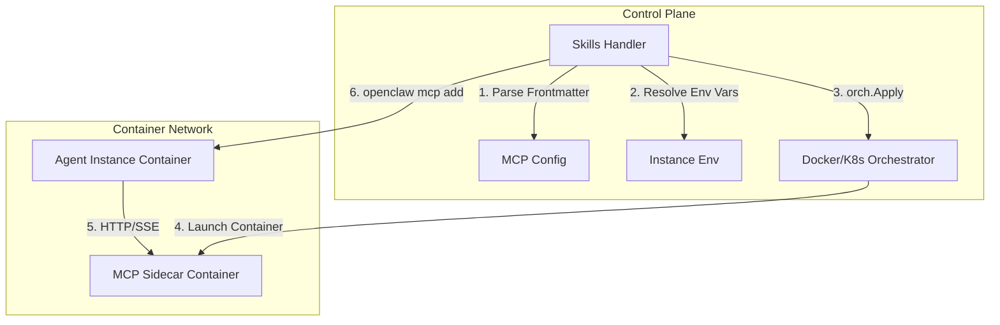
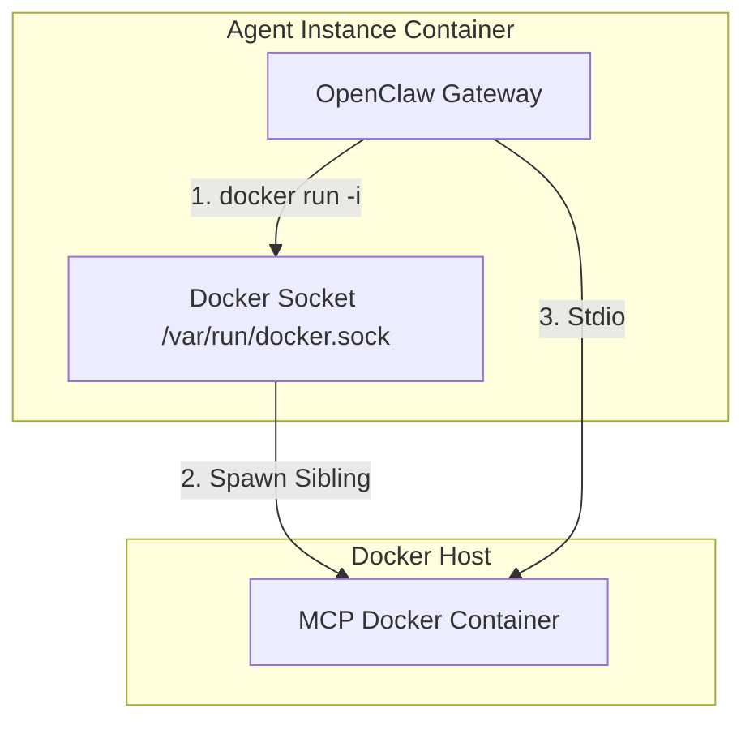

# Exploration: Integrating and Managing MCP Servers in Claworc

This document explores architectural approaches for managing and integrating Model Context Protocol (MCP) servers (like Composio) in Claworc. It details the current architecture of Claworc's Skills system and container orchestration, proposes three integration approaches, compares them, and provides a proposed YAML configuration schema and implementation roadmap.

---

## 1. Current Architecture Overview

To design an integration path for MCP servers, we first analyze the relevant systems in the existing Claworc codebase:

### 1.1 Agent Instance Container
- **Base OS**: Debian Bookworm, running a globally installed npm package `openclaw` as the core agent runner.
- **Services**: Managed via `s6-overlay` (`svc-openclaw`, `svc-sshd`, `svc-cron`).
- **Orchestration**: The control plane uses a unified `ContainerOrchestrator` interface (implemented by `DockerOrchestrator` and `KubernetesOrchestrator`) to manage agent instances.
- **Communication**: The control plane communicates with running agent instances over SSH using `SSHInstance` and `ExecOpenclaw` to perform configuration and CLI-based updates.

### 1.2 Skills System
- **Definition**: A skill is currently a directory of files deployed to `/home/claworc/.openclaw/skills/<slug>` on the agent instance.
- **Metadata**: Each skill defines its properties in the `SKILL.md` frontmatter, including a `name`, `description`, and `required_env_vars` (e.g., `API_KEY`).
- **Deployment Flow**:
  1. The user requests a skill deployment.
  2. The control plane parses the `SKILL.md` frontmatter to find required environment variables.
  3. It validates that the required variables exist in the merged environment (combining global settings in `default_env_vars` and instance-specific `EnvVars`).
  4. It uploads the skill directory via SSH using `sshproxy.WriteFile`.
  5. The `openclaw` gateway detects/loads the skill.

### 1.3 OpenClaw MCP Architecture
OpenClaw supports the Model Context Protocol (MCP) and has a CLI interface (`openclaw mcp <add|unset>`) to manage configured MCP servers.
- **Composio Integration**: Claworc already includes a hardcoded integration for Composio. If `COMPOSIO_API_KEY` is present in the merged environment variables of an instance, the control plane executes:
  ```bash
  openclaw mcp add composio --transport sse --url https://connect.composio.dev/mcp --header x-consumer-api-key=$COMPOSIO_API_KEY --header Authorization=Bearer $COMPOSIO_API_KEY --no-probe
  ```
- **Transports**: OpenClaw natively supports:
  1. **SSE (Server-Sent Events)**: Communicating over HTTP/SSE with a running server.
  2. **Stdio**: Spawning a process and communicating via standard input/output streams.

---

## 2. Proposed Integration Approaches

We propose three approaches to integrate MCP servers as part of the Skill deployment lifecycle.

### Approach A: Sibling/Sidecar Containers Orchestrated by the Control Plane (SSE)

In this approach, when a skill containing an MCP server configuration is deployed, the control plane orchestrates a separate container (a sibling container or pod sidecar) on the same virtual network as the agent instance. The agent connects to it via the SSE transport.



1. **Frontmatter Configuration**:
   The skill specifies the Docker image, run command, ports, and env mapping:
   ```yaml
   mcp:
     name: postgres-mcp
     transport: sse
     docker:
       image: "mcp/postgres-server:latest"
       command: ["node", "/app/index.js"]
       port: 8080
       env:
         DATABASE_URL: "{{PG_CONN_STR}}"
   ```
2. **Lifecycle Management**:
   - **Deploy**: The control plane parses the `mcp` block, resolves environment variable templates (e.g. `{{PG_CONN_STR}}` from instance/global env), and calls `orchestrator.Apply(...)` with a custom `WorkloadSpec` for `mcp-<instance-id>-<skill-slug>`. Once running, the control plane retrieves its internal network IP/hostname and registers it with the agent using:
     ```bash
     openclaw mcp add postgres-mcp --transport sse --url http://mcp-<instance-id>-<skill-slug>:8080/sse
     ```
   - **Undeploy/Delete**: Deletes the sibling container and unsets the MCP config in the agent.

* **Pros**:
  - **High Security**: The agent instance container does not need Docker socket access (no host-escape risk).
  - **Isolation**: Resource limits (CPU/Memory) can be set separately per MCP server container.
  - **K8s Friendly**: Easily maps to Kubernetes sidecar containers in the same Pod or sibling deployments within the namespace.
* **Cons**:
  - **Complexity**: Requires orchestrating and cleaning up multiple additional containers.
  - **SSE Dependency**: The MCP server image must support SSE transport (not all MCP servers do; many only implement stdio).

---

### Approach B: Agent-Local Processes (Stdio via Node/Python)

In this approach, the MCP server is executed as a child process directly inside the agent instance container. No extra container is spun up.

```mermaid
graph TD
    subgraph Control Plane
        H[Skills Handler] -->|1. Deploy Skill Files| SSH[SSH Write]
    end
    subgraph Agent Instance Container
        SSH -->|2. Files on disk| Workspace[/.openclaw/skills]
        Agent[OpenClaw Gateway] -->|3. Spawn Process| MCP[Local Stdio Process]
    end
    H -->|4. Register MCP Server| Agent
```

1. **Frontmatter Configuration**:
   The skill specifies a local process command:
   ```yaml
   mcp:
     name: github-mcp
     transport: stdio
     command: "npx"
     args: ["-y", "@modelcontextprotocol/server-github"]
     env:
       GITHUB_PERSONAL_ACCESS_TOKEN: "{{GITHUB_PERSONAL_ACCESS_TOKEN}}"
   ```
2. **Lifecycle Management**:
   - The control plane copies the skill files.
   - It executes `openclaw mcp add` via SSH, passing the command, arguments, and resolved env vars:
     ```bash
     openclaw mcp add github-mcp --transport stdio --command npx --args "-y @modelcontextprotocol/server-github" --env GITHUB_PERSONAL_ACCESS_TOKEN=$GITHUB_PERSONAL_ACCESS_TOKEN
     ```
   - The agent gateway automatically spawns `npx` as a child process and communicates via stdin/stdout.

* **Pros**:
  - **Simplicity**: No container orchestration changes required.
  - **Stdio Compatibility**: Works with 100% of standard MCP servers (which all support stdio).
  - **Zero Network Overhead**: Stdio communication is direct and has minimal latency.
* **Cons**:
  - **Dependency Pollution**: The agent container must have the necessary runtimes (Node, Python, Bun) and compile dependencies installed or fetch them on the fly.
  - **Shared Sandbox**: Vulnerable MCP servers have full access to the agent's file system, and their resource consumption directly impacts the main agent.

---

### Approach C: Agent-Orchestrated Docker Containers (Docker-in-Docker / Stdio)

In this approach, the agent container runs Docker commands directly (e.g. `docker run -i`) to spawn the MCP server as a container, communicating via stdio.



1. **Orchestrator Setup**:
   - The control plane mounts the host's Docker socket `/var/run/docker.sock` to `/var/run/docker.sock` inside the agent instance container at creation time.
2. **Frontmatter Configuration**:
   ```yaml
   mcp:
     name: github-mcp
     transport: stdio
     command: "docker"
     args: ["run", "-i", "--rm", "-e", "GITHUB_PERSONAL_ACCESS_TOKEN={{GITHUB_PERSONAL_ACCESS_TOKEN}}", "mcp/github-server:latest"]
   ```
3. **Lifecycle Management**:
   - The control plane registers the `docker run` command with the agent's gateway.
   - The agent executes the command, running the container under the host's Docker daemon but communicating with it over standard streams.

* **Pros**:
  - **Stdio Transport**: Works with all Docker-packaged MCP servers.
  - **Clean Environment**: No need to install Node/Python dependencies in the agent container.
* **Cons**:
  - **Severe Security Risk**: Mounting `/var/run/docker.sock` gives the agent container root-equivalent access to the entire host system, violating sandbox boundaries.
  - **K8s Incompatibility**: Direct Docker socket mounting is highly insecure and unusable in standard Kubernetes environments.

---

## 3. Comparison Matrix

| Criteria | Approach A: Sibling/Sidecar (SSE) | Approach B: Local Process (Stdio) | Approach C: Agent-Orchestrated Docker |
| :--- | :--- | :--- | :--- |
| **Security / Sandbox** | **Excellent** (Strong isolation, no socket leak) | **Good** (Shared sandbox, but restricted) | **Very Poor** (Requires Docker socket, host-escape risk) |
| **Compatibility** | **High** (Docker & K8s sidecars) | **High** (Runs anywhere Node/Python runs) | **Low** (Fails on K8s and non-Docker setups) |
| **MCP Server Support** | **Medium** (Only servers supporting SSE) | **High** (All stdio-based servers) | **High** (All stdio-based Docker servers) |
| **Agent Image Bloat** | **Low** (Dependencies kept in separate images) | **High** (Needs runtimes, compilers, package managers) | **Low** (Dependencies kept in separate images) |
| **Control Plane Effort** | **High** (Requires orchestrating sibling containers) | **Low** (Simple SSH registration commands) | **Medium** (Socket mounting and container permissions) |
| **Latency/Performance** | **Medium** (TCP loopback overhead) | **Excellent** (Direct UNIX pipes) | **Excellent** (Direct UNIX pipes/streams) |

---

## 4. Proposed Design: The Hybrid Solution

We recommend a **Hybrid Solution** that leverages **Approach A (Orchestrated Sibling Container)** as the primary method for Docker-packaged servers, and falls back to **Approach B (Local Process)** for simple script-based or Node-based servers that don't need compilation or isolated OS files.

### 4.1 Schema Extension for `SKILL.md`

We propose adding a standard `mcp` block to the frontmatter of `SKILL.md`:

```yaml
---
name: sample-mcp-skill
description: "Sample MCP server skill integration"
required_env_vars:
  - GITHUB_TOKEN

# Proposed MCP configuration
mcp:
  name: github-mcp
  transport: sse           # "sse" or "stdio"
  
  # Configuration if running as an orchestrated container (Approach A)
  docker:
    image: "mcp/github-server:latest"
    port: 8080             # Target port for SSE
    env:
      GITHUB_PERSONAL_ACCESS_TOKEN: "{{GITHUB_TOKEN}}"
  
  # Configuration if running as a local process (Approach B)
  local:
    command: "npx"
    args:
      - "-y"
      - "@modelcontextprotocol/server-github"
    env:
      GITHUB_PERSONAL_ACCESS_TOKEN: "{{GITHUB_TOKEN}}"
---
```

### 4.2 Implementation Roadmap

1. **Step 1: Enhance Skill Frontmatter Parser**
   Update `skillFrontmatter` in [skills.go](file:///home/ubuntu/claworc/control-plane/internal/handlers/skills.go#L150) to parse the `mcp` structure:
   ```go
   type mcpConfig struct {
       Name      string            `yaml:"name"`
       Transport string            `yaml:"transport"`
       Docker    *mcpDockerConfig  `yaml:"docker,omitempty"`
       Local     *mcpLocalConfig   `yaml:"local,omitempty"`
   }
   ```

2. **Step 2: Environment Variable Resolution**
   Before running any MCP server, the control plane will resolve `{{ENV_VAR}}` references using instance environment variables loaded via [LoadInstanceEnvVars](file:///home/ubuntu/claworc/control-plane/internal/handlers/envvars.go#L105).

3. **Step 3: Update Container Orchestrator (for SSE/Docker Mode)**
   - Add a method to `ContainerOrchestrator`:
     ```go
     ApplyMCPSidecar(ctx context.Context, instanceName string, skillSlug string, spec WorkloadSpec) error
     DeleteMCPSidecar(ctx context.Context, instanceName string, skillSlug string) error
     ```
   - On Docker, this runs the image on the `claworc` bridge network. On K8s, it deploys a sibling Pod/Deployment or dynamically adds a container to the existing pod (if supported by the scheduler).

4. **Step 4: Hook into Skill Lifecycle**
   In [DeploySkill](file:///home/ubuntu/claworc/control-plane/internal/handlers/skills.go#L796):
   - If `mcp` config is present and specifies `docker`, trigger `ApplyMCPSidecar`.
   - Once running, run `openclaw mcp add` inside the agent.
   - If it specifies `local`, run `openclaw mcp add` using the `local` process settings.
