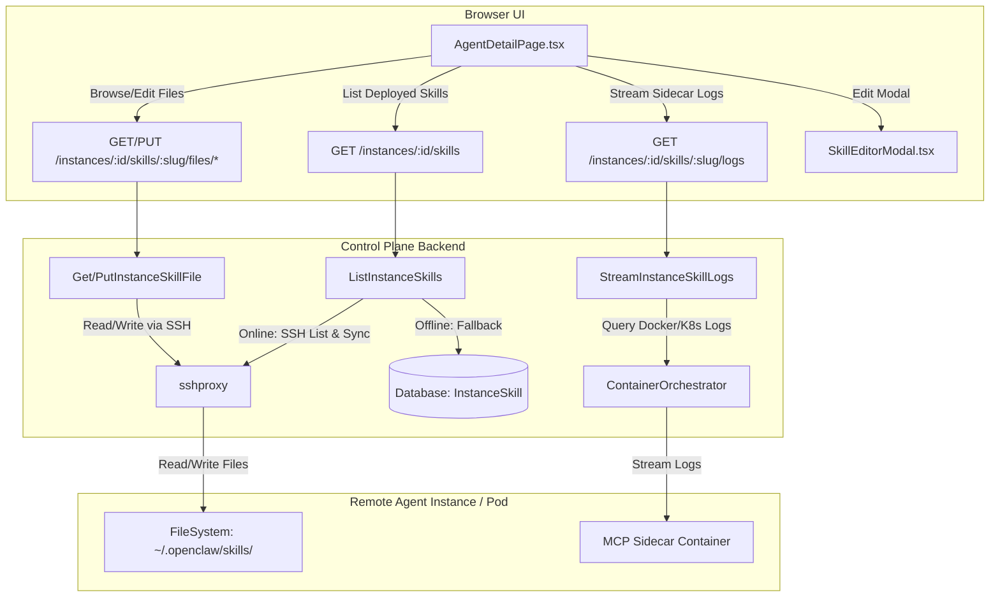

# Technical Design: Agent Skills Management

This design document outlines the implementation plan for enabling visibility, editing, and debugging of active/deployed Model Context Protocol (MCP) skills directly on individual agents via the web interface.

---

## 1. Architecture Overview

The Agent Skills Management capability connects the control plane database, remote agent filesystems (accessed via SSH), and container orchestrators to provide real-time interaction with deployed agent skills.



---

## 2. Data Model & Schema Migration

We introduce the `InstanceSkill` model to cache the deployed skills state per agent. This provides fallback database records when an agent is stopped or offline.

### 2.1 GORM Model Definition
Add the following model to [models.go](file:///home/ubuntu/claworc/control-plane/internal/database/models/models.go):

```go
type InstanceSkill struct {
	ID         uint      `gorm:"primaryKey;autoIncrement" json:"id"`
	InstanceID uint      `gorm:"uniqueIndex:idx_instance_skill_slug;not null" json:"instance_id"`
	Slug       string    `gorm:"uniqueIndex:idx_instance_skill_slug;not null" json:"slug"`
	Name       string    `gorm:"not null" json:"name"`
	Summary    string    `json:"summary"`
	Status     string    `gorm:"not null;default:'deployed'" json:"status"` // "deployed" | "error"
	CreatedAt  time.Time `gorm:"autoCreateTime" json:"created_at"`
	UpdatedAt  time.Time `gorm:"autoUpdateTime" json:"updated_at"`

	// Foreign key referencing Instance with cascade delete to prevent orphans when an Instance is deleted
	Instance   Instance  `gorm:"foreignKey:InstanceID;constraint:OnDelete:CASCADE" json:"-"`
}

```

### 2.2 Re-exports & Type Aliases
Update [models.go (parent)](file:///home/ubuntu/claworc/control-plane/internal/database/models.go) to expose the alias:

```go
type (
    // ...
    InstanceSkill = models.InstanceSkill
)
```

### 2.3 Goose Database Migration
Create a new migration file `control-plane/internal/database/migrations/migration_00009_create_instance_skills.go`:

```go
package migrations

import (
	"context"
	"database/sql"

	"github.com/pressly/goose/v3"
	"gorm.io/gorm"

	"github.com/gluk-w/claworc/control-plane/internal/database/models"
)

func init() {
	register(&goose.Migration{
		Version: 9,
		Source:  "00009_create_instance_skills.go",
		UpFnContext: func(ctx context.Context, tx *sql.Tx) error {
			return WithMigrator(ctx, tx, func(m gorm.Migrator, _ *gorm.DB) error {
				if !m.HasTable(&models.InstanceSkill{}) {
					// CreateTable automatically configures the ON DELETE CASCADE constraint on the database
					// based on the constraint:OnDelete:CASCADE tag on the Instance relation.
					if err := m.CreateTable(&models.InstanceSkill{}); err != nil {
						return err
					}
				}
				if !m.HasIndex(&models.InstanceSkill{}, "idx_instance_skill_slug") {
					if err := m.CreateIndex(&models.InstanceSkill{}, "idx_instance_skill_slug"); err != nil {
						return err
					}
				}
				return nil
			})
		},
		DownFnContext: func(ctx context.Context, tx *sql.Tx) error {
			return WithMigrator(ctx, tx, func(m gorm.Migrator, _ *gorm.DB) error {
				if m.HasTable(&models.InstanceSkill{}) {
					if err := m.DropTable(&models.InstanceSkill{}); err != nil {
						return err
					}
				}
				return nil
			})
		},
	})
}
```

### 2.4 Auto-Migration & Registry Verification
1. Append `&models.InstanceSkill{}` to `AutoMigrateAll` in [migration_00001_baseline.go](file:///home/ubuntu/claworc/control-plane/internal/database/migrations/migration_00001_baseline.go).
2. Append `&database.InstanceSkill{}` to `allMigratedModels` in [migrationcheck/main.go](file:///home/ubuntu/claworc/control-plane/cmd/migrationcheck/main.go).

---

## 3. Backend Endpoints Design

Register the following new API routes in [main.go](file:///home/ubuntu/claworc/control-plane/main.go) under the authenticated route group `r.Group(func(r chi.Router) { r.Use(middleware.RequireAuth(sessionStore)) ... })`:

```go
r.Get("/instances/{id}/skills", handlers.ListInstanceSkills)
r.Get("/instances/{id}/skills/{slug}/files", handlers.ListInstanceSkillFiles)
r.Get("/instances/{id}/skills/{slug}/files/*", handlers.GetInstanceSkillFile)
r.Put("/instances/{id}/skills/{slug}/files/*", handlers.PutInstanceSkillFile)
r.Get("/instances/{id}/skills/{slug}/logs", handlers.StreamInstanceSkillLogs)
```

### 3.1 Fetching Skills List (Hybrid DB/SSH Sync)
The handler `ListInstanceSkills` queries the remote agent filesystem when online and falls back to cached DB state when offline (safe offline fallback).

#### Slug Validation:
Slugs are validated using a regex to prevent directory traversal or command injection:
```go
var slugRegex = regexp.MustCompile(`^[a-zA-Z0-9_-]+$`)

func isValidSlug(slug string) bool {
	return slugRegex.MatchString(slug)
}
```
Any slug not matching this regex must be immediately rejected with `HTTP 400 Bad Request`.

#### Logic Flow:
1. Parse `id` and load the instance from the database.
2. Check authorization: `middleware.CanAccessInstance(r, inst.ID)`.
3. Try fetching SSH connection: `client, ok := SSHMgr.GetConnection(inst.ID)`.
4. **If Online (`ok == true`):**
   - Query remote directory `/home/claworc/.openclaw/skills/` using `sshproxy.ListDirectory(client, "/home/claworc/.openclaw/skills")`.
   - If the directory does not exist (e.g. `ls` returns exit code 2 or error contains "No such file or directory"), treat as `0` deployed skills, delete all `InstanceSkill` rows for this `InstanceID` in the DB, and return `[]`.
   - Otherwise, iterate through all listed subdirectories (each represents a deployed skill `slug`):
     - Verify that the `slug` is valid using `isValidSlug(slug)`. Skip invalid subdirectories.
     - Read `/home/claworc/.openclaw/skills/{slug}/SKILL.md` using `sshproxy.ReadFile`.
     - Parse the frontmatter using the existing `parseSkillFrontmatter(content)`.
     - On successful parse, upsert (insert or update) an `InstanceSkill` database record mapping the `InstanceID` and `Slug` with metadata (`Name`, `Summary`, `status: "deployed"`).
     - **GORM OnConflict Clause for Upsert**:
       ```go
       err := db.Clauses(clause.OnConflict{
           Columns:   []clause.Column{{Name: "instance_id"}, {Name: "slug"}},
           DoUpdates: clause.AssignmentColumns([]string{"name", "summary", "status", "updated_at"}),
       }).Create(&instanceSkill).Error
       ```
     - Keep track of all "seen" slugs during this run.
   - Query all existing `InstanceSkill` DB records for this `InstanceID` and delete any whose slug was **not** seen (garbage collection of uninstalled skills).
5. **If Offline (`ok == false`):**
   - Skip SSH query.
   - Fetch cached records from `InstanceSkill` database table for this `InstanceID`.
6. Return the list of `InstanceSkill` records as JSON.

---

### 3.2 Remote Filesystem Browsing & Sandbox Protection
To allow the frontend file editor to interact with remote files safely, we implement path resolution and directory walking.

#### Sandbox Resolution Helper:
Any remote skill path is constructed by taking a relative path `relPath` and resolving it strictly within the remote base folder.
```go
func resolveRemoteSkillFilePath(slug, relPath string) (string, error) {
	if !isValidSlug(slug) {
		return "", fmt.Errorf("invalid skill slug")
	}
	if relPath == "" {
		return "", fmt.Errorf("path required")
	}
	cleanRel := path.Clean(relPath)
	if strings.HasPrefix(cleanRel, "/") || strings.HasPrefix(cleanRel, "..") || cleanRel == ".." {
		return "", fmt.Errorf("invalid file path")
	}
	remoteRoot := "/home/claworc/.openclaw/skills/" + slug
	absPath := path.Clean(path.Join(remoteRoot, cleanRel))
	if !strings.HasPrefix(absPath, remoteRoot+"/") && absPath != remoteRoot {
		return "", fmt.Errorf("invalid file path")
	}
	return absPath, nil
}
```

#### ListInstanceSkillFiles (GET `/instances/{id}/skills/{slug}/files`)
Retrieves all files inside a deployed skill's remote folder.
1. Check if the instance is online. If offline, return `HTTP 503 Service Unavailable` with message `"Agent must be running to view skill files"`.
2. Check if the slug is valid using `isValidSlug(slug)`. If invalid, return `HTTP 400 Bad Request`.
3. **POSIX-only Walk Command (No Python3)**:
   Run a `find` command combined with standard POSIX shell tools (`sh`, `wc`, `dd`, `tr`) via `sshproxy.RunCommand`. The command prunes `node_modules`, `.git`, and `.venv` folders, measures file sizes, and checks for binary files by scanning the first 8KB of each file for NUL bytes.
   
   ```bash
   find /home/claworc/.openclaw/skills/<slug> \( -name .git -o -name node_modules -o -name .venv \) -prune -o -type f -exec sh -c '
     root="/home/claworc/.openclaw/skills/<slug>"
     root_clean=${root%/}
     for file do
       sz=$(wc -c < "$file")
       # Read first 8KB (8 blocks of 1024 bytes) and search for NUL bytes using tr and wc
       if [ $(dd if="$file" bs=1024 count=8 2>/dev/null | tr -d -c "\000" | wc -c) -gt 0 ]; then
         is_bin="true"
       else
         is_bin="false"
       fi
       rel_path=${file#"$root_clean/"}
       echo "$sz $is_bin $rel_path"
     done
   ' sh {} +
   ```
   *Note: In Go, `/home/claworc/.openclaw/skills/<slug>` is interpolated using `sshproxy.ShellQuote(slug)` and the base path is fully quoted using `sshproxy.ShellQuote` to prevent command injection.*
4. Parse the printed stdout lines (`{size} {is_binary} {rel_path}`) and return them as a JSON list of `skillFileEntry`.

#### GetInstanceSkillFile (GET `/instances/{id}/skills/{slug}/files/*`)
1. Check if the instance is online. If offline, return `HTTP 503`.
2. Check slug validity.
3. Resolve absolute path: `absPath, err := resolveRemoteSkillFilePath(slug, chi.URLParam(r, "*"))`.
4. **Maximum File Size Cap Check (2MB Limit)**:
   Query the file size first by running `wc -c < filePath` over SSH:
   ```go
   sizeCmd := fmt.Sprintf("wc -c < %s", sshproxy.ShellQuote(absPath))
   sizeStdout, _, _, err := sshproxy.RunCommand(client, sizeCmd)
   // Parse sizeStdout to int64. If size > 2*1024*1024, reject with HTTP 413 Payload Too Large.
   ```
5. Read the file: `data, err := sshproxy.ReadFile(client, absPath)`.
6. Sniff for binary bytes. If text, return the contents inside a `skillFileContent` JSON object.

---

### 3.3 Remote File Modifying & Hot Reload Config
The `PutInstanceSkillFile` handler updates remote skill files and dynamically re-applies MCP server configurations when `SKILL.md` is modified.

#### Logic Flow:
1. Parse instance, slug, and file relative path from route.
2. Check slug validity using `isValidSlug(slug)`. If invalid, return `HTTP 400`.
3. Check authorization: `middleware.CanMutateInstance(r, inst.ID)`.
4. Check online status. If offline, reject with `HTTP 412 Precondition Failed` / `HTTP 503` (REQ-7).
5. Parse request body containing `{ "content": "..." }`.
6. **Maximum File Size Cap Check (2MB Limit)**:
   Validate the body size of the content to be written. If `len(body.Content) > 2*1024*1024` (2MB), reject the request with `HTTP 413 Payload Too Large`.
7. **Re-Apply Configuration Check (REQ-6):**
   - If the target file is `SKILL.md`:
     - Read the **old** `SKILL.md` content from the remote agent: `oldContent, err := sshproxy.ReadFile(client, remoteSKILLMDPath)`.
     - Parse old frontmatter `oldFM, err := parseSkillFrontmatter(oldContent)`.
     - Parse new frontmatter `newFM, err := parseSkillFrontmatter(newContent)`.
8. Write the new content to the remote agent filesystem using `sshproxy.WriteFile`.
9. **Config Re-application:**
   - If `SKILL.md` was edited and frontmatter changed:
     - Run the teardown steps for `oldFM.MCP` if it existed (e.g. run `ExecOpenclaw(ctx, "mcp", "unset", oldName)`, and if SSE transport, delete the sidecar container `mcp-{id}-{slug}`).
     - Run deployment steps for `newFM.MCP` if it exists:
       - Merging environment variables (global and per-instance).
       - If transport is `"sse"`: Create and start the sidecar workload container via `ContainerOrchestrator.Apply` and run `mcp add <name> --transport sse --url http://mcp-{id}-{slug}:{port}/sse`.
       - If transport is `"stdio"`: Run `mcp add <name> --transport stdio --command <command> ...`.

---

### 3.4 Container Log Streaming & Interface Upgrade
To support Server-Sent Events (SSE) log streaming for sidecar workloads, we add log streaming capabilities to the orchestrator layer.

#### Upgrading ContainerOrchestrator
Add `StreamWorkloadLogs` to [orchestrator.go](file:///home/ubuntu/claworc/control-plane/internal/orchestrator/orchestrator.go):

```go
type ContainerOrchestrator interface {
	// ... existing methods
	StreamWorkloadLogs(ctx context.Context, name string, follow bool, tailLines int64, writer io.Writer) error
}
```

#### Implementations:
1. **Docker (`control-plane/internal/orchestrator/docker.go`):**
   Use the Docker SDK `ContainerLogs` client method. To handle stdout/stderr multiplexing properly, utilize `github.com/docker/docker/pkg/stdcopy`.
   ```go
   func (d *DockerOrchestrator) StreamWorkloadLogs(ctx context.Context, name string, follow bool, tailLines int64, writer io.Writer) error {
   	opts := container.LogsOptions{
   		ShowStdout: true,
   		ShowStderr: true,
   		Follow:     follow,
   	}
   	if tailLines > 0 {
   		opts.Tail = fmt.Sprintf("%d", tailLines)
   	} else {
   		opts.Tail = "all"
   	}
   	reader, err := d.client.ContainerLogs(ctx, name, opts)
   	if err != nil {
   		return err
   	}
   	defer reader.Close()
   
   	_, err = stdcopy.StdCopy(writer, writer, reader)
   	return err
   }
   ```

2. **Kubernetes (`control-plane/internal/orchestrator/kubernetes.go`):**
   Fetch the pod name for the sidecar deployment using labels, then stream its logs via `GetLogs().Stream()`.
   ```go
   func (k *KubernetesOrchestrator) StreamWorkloadLogs(ctx context.Context, name string, follow bool, tailLines int64, writer io.Writer) error {
   	podName, err := k.getPodName(ctx, name)
   	if err != nil {
   		return fmt.Errorf("failed to find pod: %w", err)
   	}
   	if podName == "" {
   		return fmt.Errorf("no pod found for workload: %s", name)
   	}
   	opts := &corev1.PodLogOptions{
   		Follow: follow,
   	}
   	if tailLines > 0 {
   		opts.TailLines = &tailLines
   	}
   	req := k.clientset.CoreV1().Pods(k.ns()).GetLogs(podName, opts)
   	stream, err := req.Stream(ctx)
   	if err != nil {
   		return err
   	}
   	defer stream.Close()
   
   	_, err = io.Copy(writer, stream)
   	return err
   }
   ```

3. **Mock (`control-plane/internal/handlers/ssh_test.go` and `configure_test.go`):**
   The mock struct in `configure_test.go` named `mockOps` is renamed to `mockOrchestrator` to consolidate testing models under `handlers` package. Add the required log streaming method to it:
   ```go
   func (m *mockOrchestrator) StreamWorkloadLogs(_ context.Context, _ string, _ bool, _ int64, _ io.Writer) error {
   	return nil
   }
   ```

#### StreamInstanceSkillLogs Handler (SSE Setup)
1. Verify access via `middleware.CanAccessInstance`.
2. Check slug validity using `isValidSlug(slug)`. If invalid, return `HTTP 400 Bad Request`.
3. Determine sidecar container name: `sidecarName := fmt.Sprintf("mcp-%d-%s", instanceID, slug)`.
4. Set SSE response headers:
   ```go
   w.Header().Set("Content-Type", "text/event-stream")
   w.Header().Set("Cache-Control", "no-cache")
   w.Header().Set("Connection", "keep-alive")
   w.Header().Set("X-Accel-Buffering", "no")
   ```
5. Setup an `io.Pipe` and a background reader goroutine to format incoming logs as SSE `data: <line>\n\n` packets.
   **Log Scanner Buffer Configuration (2MB limit)**: To handle very large logs safely without crashing or throwing `bufio.ErrTooLong`, configure the scanner with a 2MB maximum token size buffer:
   ```go
   pr, pw := io.Pipe()
   flusher := w.(http.Flusher)
   flusher.Flush()
   
   go func() {
   	defer pr.Close()
   	scanner := bufio.NewScanner(pr)
   	buf := make([]byte, 64*1024)
   	scanner.Buffer(buf, 2*1024*1024) // Set max token size to 2MB to support large log lines
   	for scanner.Scan() {
   		line := scanner.Text()
   		fmt.Fprintf(w, "data: %s\n\n", line)
   		flusher.Flush()
   	}
   }()
   
   err := orch.StreamWorkloadLogs(r.Context(), sidecarName, follow, int64(tail), pw)
   pw.Close()
   ```

---

## 4. Frontend Integration

### 4.1 Update API & Query Hooks
Update `frontend/src/common/api/skills.ts` and `frontend/src/common/hooks/useSkills.ts` to support instance scopes:

```typescript
// frontend/src/common/api/skills.ts
export async function listInstanceSkills(id: number): Promise<InstanceSkill[]> {
  const { data } = await client.get<InstanceSkill[]>(`/instances/${id}/skills`);
  return data;
}

export async function listInstanceSkillFiles(id: number, slug: string): Promise<SkillFileEntry[]> {
  const { data } = await client.get<SkillFileEntry[]>(`/instances/${id}/skills/${slug}/files`);
  return data;
}

export async function getInstanceSkillFile(id: number, slug: string, path: string): Promise<SkillFileContent> {
  const { data } = await client.get<SkillFileContent>(`/instances/${id}/skills/${slug}/files/${encodeSkillPath(path)}`);
  return data;
}

export async function saveInstanceSkillFile(id: number, slug: string, path: string, content: string): Promise<void> {
  await client.put(`/instances/${id}/skills/${slug}/files/${encodeSkillPath(path)}`, { content });
}
```

Support optional `instanceId` inside hooks in `frontend/src/common/hooks/useSkills.ts`:
```typescript
export function useSkillFiles(slug: string | null, instanceId?: number) {
  return useQuery({
    queryKey: instanceId ? ["instance-skill-files", instanceId, slug] : ["skill-files", slug],
    queryFn: () => instanceId ? listInstanceSkillFiles(instanceId, slug as string) : listSkillFiles(slug as string),
    enabled: !!slug,
  });
}

export function useSkillFile(slug: string | null, path: string | null, instanceId?: number) {
  return useQuery({
    queryKey: instanceId ? ["instance-skill-file", instanceId, slug, path] : ["skill-file", slug, path],
    queryFn: () => instanceId ? getInstanceSkillFile(instanceId, slug as string, path as string) : getSkillFile(slug as string, path as string),
    enabled: !!slug && !!path,
  });
}

export function useSaveSkillFile(slug: string, instanceId?: number) {
  const qc = useQueryClient();
  return useMutation({
    mutationFn: ({ path, content }: { path: string; content: string }) =>
      instanceId ? saveInstanceSkillFile(instanceId, slug, path, content) : saveSkillFile(slug, path, content),
    onSuccess: (_data, { path }) => {
      if (instanceId) {
        qc.invalidateQueries({ queryKey: ["instance-skill-files", instanceId, slug] });
        qc.invalidateQueries({ queryKey: ["instance-skill-file", instanceId, slug, path] });
        qc.invalidateQueries({ queryKey: ["instances", instanceId] });
      } else {
        qc.invalidateQueries({ queryKey: ["skill-files", slug] });
        qc.invalidateQueries({ queryKey: ["skill-file", slug, path] });
        if (path === "SKILL.md") {
          qc.invalidateQueries({ queryKey: ["skills"] });
        }
      }
      successToast("File saved");
    },
    onError: (error) => errorToast("Failed to save file", error),
  });
}
```

---

### 4.2 "Skills" Tab in `AgentDetailPage.tsx`
Add a new tab view inside [AgentDetailPage.tsx](file:///home/ubuntu/claworc/control-plane/frontend/src/app/pages/AgentDetailPage.tsx).

1. Add `"skills"` to the `Tab` union type:
   ```typescript
   type Tab = "chat" | "terminal" | "files" | "config" | "logs" | "settings" | "skills";
   ```
2. Insert tab metadata into the `tabs` array:
   ```typescript
   { key: "skills", label: "Skills" }
   ```
3. Add render logic for `activeTab === "skills"`:
   - When the agent is Stopped/Offline, render `TabPlaceholder` showing a list of cached database skills along with an `"offline"` badge next to each.
   - When the agent is Running, display the live list of skills with status badges.
   - Each skill card displays:
     - Name & Description.
     - Transport details (e.g. SSE sidecar or STDIO process).
     - Action buttons:
       - **Edit Files**: Opens `SkillEditorModal` passing the `instanceId={instance.id}` and `skill`.
       - **View Logs**: Mounts a local SSE log stream viewer that connects to `/api/v1/instances/{id}/skills/{slug}/logs`.

---

### 4.3 Skill Editor Modal Parameterization
Update [SkillEditorModal.tsx](file:///home/ubuntu/claworc/control-plane/frontend/src/common/components/skills/SkillEditorModal.tsx) to accept an optional `instanceId?: number` prop, and pass it down to `useSkillFiles`, `useSkillFile`, and `useSaveSkillFile`.

```typescript
interface SkillEditorModalProps {
  skill: Skill;
  instanceId?: number; // Added to enable remote editing
  onClose: () => void;
}

export default function SkillEditorModal({ skill, instanceId, onClose }: SkillEditorModalProps) {
  const { data: files, isLoading: filesLoading } = useSkillFiles(skill.slug, instanceId);
  const save = useSaveSkillFile(skill.slug, instanceId);
  // ...
  const { data: fileContent, isLoading: contentLoading } = useSkillFile(
    selectedEntry && !selectedEntry.binary ? skill.slug : null,
    selectedEntry && !selectedEntry.binary ? selectedEntry.path : null,
    instanceId,
  );
  // ...
}
```

---

## 5. Security & Validation Rationale

### 5.1 Remote Path Injection Prevention
We sanitize file paths using `path.Clean` and verify that the clean path is prefixed by the skill root folder (`/home/claworc/.openclaw/skills/{slug}/`). Any path containing `..` or leading `/` is immediately rejected. This prevents arbitrary remote file reads/writes.

### 5.2 Offline Protection
Remote file edits and listing queries are blocked if the agent's SSH connection is not active or if the instance status is not running. This ensures we do not block threads with long SSH timeouts or perform unauthenticated modifications.

### 5.3 Parallelized Remote Walks
Rather than scanning directories using sequential `ls`/`stat` commands (which adds significant SSH roundtrip latency), a single POSIX-compliant `find` command gathers the complete file hierarchy, metadata, and binary state. By using standard shell utilities like `dd`, `tr`, and `wc` to detect binary file flags, we avoid any python3 dependency on the target agent entirely.

Crucially, deep build, dependency, and control directory folders (`node_modules`, `.git`, and `.venv`) are pruned during the find execution. This results in minimal SSH overhead and sub-200ms response times even for large project directories.

### 5.4 Resource Limits & Buffer Safety
- **Maximum File Size Limit (2MB)**: Before reading remote files or writing to them, the control plane ensures the file size does not exceed 2MB. This protects control plane memory and prevents bandwidth depletion.
- **Log Streaming Safe Scanner (2MB)**: SSE log streaming reads lines through a `bufio.Scanner` with a configured buffer size of 2MB to prevent crashes due to long log lines (e.g. serialized JSON objects or raw payload logs).

---

## 6. Mock Struct Consolidation

To keep tests consistent and avoid duplicate helper types in the `handlers` package, the testing mock `mockOps` in [configure_test.go](file:///home/ubuntu/claworc/control-plane/internal/handlers/configure_test.go) is renamed to `mockOrchestrator` and consolidated with the corresponding mock defined in [ssh_test.go](file:///home/ubuntu/claworc/control-plane/internal/handlers/ssh_test.go). This ensures that a single mock structure implements `orchestrator.ContainerOrchestrator` for all package handlers under test.
